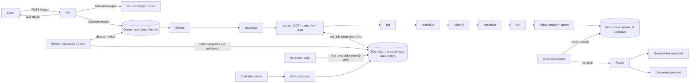

# async-doc-ingestion

Crash-safe, idempotent attachment ingestion and querying for a multi-tenant AI workspace: one async
API to submit any file, extract it, tag it, link it to related files and search it per tenant,
without paying twice for OCR or embeddings.

> A clean-room re-implementation of work I designed and built for a production
> multi-tenant AI workspace platform. No employer code; all names and data are fictional.

[](https://github.com/Tayyab-Bilal/async-doc-ingestion/actions/workflows/ci.yml)

**Scope.** This repo models the ingestion pipeline, the chat-attachment processor, the attachment
query with its fast path, and the later reliability work (sweep, retention, type contract). All
LLMs, OCR, speech-to-text, embeddings, the vector database and the web fetch are deterministic
fakes. Production-only parts are listed under [In production](#in-production).

## The problem

Users attach files everywhere in "Acme Workspace": tasks, projects, meetings, the communication
hub, compliance, spaces and email, and directly inside AI-chat messages. The assistant could read
none of them. Excel and document questions went through two separate tools, and the front end had
to say what type each file was.

The backend needs one asynchronous API that never blocks an upload. OCR is billed per page and
embeddings per text, so a worker crash, a redelivered message or a re-upload of an unchanged file
must never cost money twice.

## What it does

- **Async job API.** Submit returns 202; status polling shows per-stage progress (`api.py`,
  `service.py`).
- **Seven-stage pipeline, then a separate index task:** download, extract, tag, normalize,
  classify, metadata, link; then `index` (`pipeline.py`).
- **Crash safety by idempotent resume,** not blind retries: the OCR job id is saved before
  polling (`pipeline.py`, `celery_app.py`).
- **Re-ingest is a hash no-op;** a new URL wipes derived state and keeps history (`hashing.py`,
  `service.py`).
- **Seven source surfaces:** task, project, meeting, communication hub, compliance, space, email,
  each with its own entity context (`models.py`, `providers.py`).
- **Linking cascade,** bidirectional: keyword Jaccard, then label Jaccard, then exact metadata,
  threshold 0.4 (`linking.py`).
- **Domain and subdomain lookup,** two levels (`pipeline.py`).
- **Per-tenant vector collections;** delete returns accurate counts (`providers.py`).
- **Chat attachments:** audio transcribed inline; other files extracted once into a table so
  queries never re-download; simple RTF support; a URL fetch tool; empty file is a hard stop
  (`chat.py`, `rtf.py`).
- **Unified document routing by stored file type:** spreadsheets go to the spreadsheet and
  document specialists in parallel; the caller never declares a type (`specialists.py`).
- **Attachment query:** hybrid keyword + dense retrieval, a fast path before retrieval, and a
  per-call context envelope for parallel queries (`query.py`, `context.py`).
- **90-day retention cleanup** for chat extractions and their vectors (`retention.py`).
- **Self-healing sweep,** every 10 minutes via Celery beat (`sweep.py`, `celery_app.py`).
- **Type contract for the metering wrapper,** reproducing a real ingestion outage
  (`metering.py`).

## Quickstart

```bash
uv venv .venv && uv pip install -e ".[dev]"
.venv/bin/python examples/demo.py
.venv/bin/pytest -q          # no network, a few seconds
```

Excerpt of the demo output:

```text
== 2. Re-submit the PDF unchanged: a hash no-op
unchanged=True  OCR starts=1  embed calls=3

== 3. Worker crashes right after the OCR job started; the message is redelivered
worker died: worker died after OCR job was started; persisted ocr_job_id=ocr-2
OCR started 1 time(s) for this document

== 6. Chat attachments: extracted once, then read from the table
  offsite.txt: stored
  empty.txt: no_content
  c-2: no_content via -: no readable content
  c-3: ok via spreadsheet+document: [sheet] region,total
  files downloaded while answering: 0

== 7. Retention: chat extractions older than 90 days are removed with their vectors
cleanup: {'extractions': 1, 'vectors': 1}
```

## Usage guide

Wire the service with fakes, submit a file and poll it:

```python
import asyncio
import tempfile
import uuid
from pathlib import Path

from async_doc_ingestion.chat import ChatAttachmentProcessor
from async_doc_ingestion.models import SubmitRequest
from async_doc_ingestion.pipeline import Pipeline
from async_doc_ingestion.providers import Providers
from async_doc_ingestion.query import AttachmentQuery
from async_doc_ingestion.service import IngestService
from async_doc_ingestion.specialists import DocumentRouter, FakeSpecialist
from async_doc_ingestion.store import Store
from async_doc_ingestion.worker import InlineRunner

store = Store(str(Path(tempfile.mkdtemp()) / "readme.sqlite"))
prov = Providers.fakes()
service = IngestService(store, prov, InlineRunner(Pipeline(store, prov)))

req = SubmitRequest(tenant_id="acme", attachment_id=uuid.uuid4(), source_url="s3://docs/q3.txt",
                    filename="q3.txt", mime_type="text/plain", surface="meeting",
                    surface_id="M-3", labels=["finance"])
prov.storage.put(req.source_url, b"Invoice payment and budget for the Q3 roadmap")

job_id, unchanged = service.submit(req)
assert service.status(job_id).status == "completed" and not unchanged
assert service.submit(req) == (job_id, True)        # same file again: no-op
```

Ask a question, with a chat attachment and the workspace:

```python
chat = ChatAttachmentProcessor(store, prov)
prov.storage.put("s3://chat/n.txt", b"The offsite is on Friday.")
chat.process("acme", "c-1", "s3://chat/n.txt", "n.txt", "text/plain")

query = AttachmentQuery(store, prov, DocumentRouter(FakeSpecialist("sheet"), FakeSpecialist("doc")))
chat_answer = asyncio.run(query.ask("When is the offsite?", "acme", attachment_id="c-1"))
wide_answer = asyncio.run(query.ask("Q3 roadmap budget?", "acme"))
assert "offsite" in chat_answer.text and wide_answer.via == "hybrid"
```

More in [docs/usage.md](docs/usage.md); signatures and HTTP routes in [docs/api.md](docs/api.md).

## How it works



**Ingestion.** `submit` downloads the file once, hashes it and either returns "unchanged" or
creates or resets the job and dispatches `process`. The worker runs each unfinished stage and
saves progress after every one. When the last stage finishes, `index` embeds the text and writes
vectors into the tenant's collection. The sweep finds jobs that are `completed` but not indexed
and dispatches `index` again.

**Linking cascade.** For each other attachment of the same tenant, the signals are tried in order:
keyword Jaccard, label Jaccard, exact metadata match. A signal only applies when both sides have
data for it. The first applicable signal that scores at least 0.4 creates the link and its score is
stored; a signal that applies but scores lower falls through to the next. An exact metadata match
scores 1.0. Links are written in both directions.

**Chat.** The processor transcribes audio and returns the text inline. Any other file is
extracted once into `chat_attachments`; the vectors go in the tenant collection tagged
`source=chat`. Empty files are recorded as empty.

**Query.** `AttachmentQuery.ask` picks the attachment (explicit argument, then per-call envelope,
then shared default), then: empty file stops with "no readable content"; a spreadsheet goes to both
specialists in parallel; anything else is retrieved by `0.5 * dense + 0.5 * keyword overlap` and
passed to the document specialist.

## Design decisions

1. **Submit returns 202 at once.** Clients poll per-stage progress. Rejected: waiting for OCR in the
   request, which blocks uploads and times out.
2. **Idempotent resume, not blind retries.** Tasks are acked late with zero automatic retries, and
   the OCR job id is saved before polling, so a redelivered message re-attaches to the job in
   flight. Rejected: automatic retries, which pay for a second parse.
3. **Re-ingest is a hash no-op.** SHA-256 over metadata, sorted labels and the content hash. Here
   "source" is the bytes; production compares an ETag or version. A changed URL wipes derived state
   but keeps job history.
4. **Index is a separate step.** The sweep can redo it without redoing OCR.
5. **Self-healing sweep, claimed atomically.** One `UPDATE` selects and marks rows, so two sweeps
   never claim the same job and embeddings are never paid twice. Bounded by attempt cap 5, batch
   50 and minimum age 15 minutes. Rejected: unbounded re-dispatch.
6. **Closed status vocabulary.** Four states. An audit suggested a "degraded" state for complete
   but unindexed jobs; it was rejected because clients only know four states and a new one would
   strand jobs. They stay `completed`, `indexed=false`, and the sweep fixes them.
7. **Empty file is a hard stop.** An empty attachment must never lead to an answer from a
   different document, so the router and query stop with "no readable content" before any search.
8. **Linking is a cascade with a shared 0.4 threshold,** so different kinds of similarity can
   link files whose text differs. Rejected: keyword-only, which misses files tied by label or
   metadata.
9. **Per-call context envelope.** Parallel queries must not share a single "current attachment"
   slot (last writer wins). Precedence: explicit, per-call, shared.
10. **Per-tenant collections** (`tenant_{id}`): isolation by construction, not by filter.
11. **Wrappers subclass the library base class.** A metering wrapper that only delegated calls
    failed the vector library's `isinstance` check and every document failed. A test now fails
    for a delegating wrapper without the base class.
12. **Retries are not caught.** A stage never catches generic exceptions; a crash leaves the job
    `running` so redelivery resumes it.

## In production

These are results of the original system, not measurements made by this repo.

- About 4.2k lines of attachment service plus about 1.9k lines of query specialist, with 105
  attachment tests.
- The main pipeline delivery was +5,385 lines across 31 files, with 30 of 30 live end-to-end
  checks passing against the full stack (API, workers, SQL database, vector database): submit,
  same-URL and different-URL resubmit, cleanup.
- 7 source surfaces enriched with live business context, behind one async API used for every
  attachment type. The PDF path was validated through all 7 stages.
- About 55 tracked issues in the theme, all delivered.
- The sweep re-dispatches every 10 minutes with attempt cap 5, batch 50 and minimum age 15
  minutes.

Production-only parts that this repo does not include:

| Here | Production |
|---|---|
| `InlineRunner` | Celery with a Redis broker, beat for the sweep and cleanup, a gated migrations worker that runs vector-index migrations one at a time |
| SQLite | Postgres (`UPDATE ... RETURNING` with `FOR UPDATE SKIP LOCKED`) |
| `FakeStorage` | Object storage with pre-signed URLs and ETags for the change check |
| `FakeOCR` | A commercial OCR service billed per page; `start` returns a job id that is polled |
| `FakeTranscriber` | Whisper |
| `FakeTagger`, `FakeEntityContext` | An LLM prompted with entity context fetched from the backend for each surface |
| `InMemoryVectorStore` | Qdrant with one collection per tenant, and a keyword payload index so UUID user ids filter correctly |
| `FakeSpecialist` | LLM specialists; the query specialist is a ReAct agent in the orchestrator, discovery supplies attachment pointers |
| `FakeFetcher` | A real web fetch tool |
| No auth | Background enrichment has no user token, so it acts as the user with a service API key plus tenant and user headers (API-key impersonation); permission scoping is unchanged |
| New code path only | The legacy chat-attachment path was removed in a cutover |

## Testing

```bash
.venv/bin/pytest -q
.venv/bin/ruff check .
```

Tests prove rules with counters (OCR `starts`, embedder `calls`, storage `downloads`), not logs.

| Invariant | Test file |
|---|---|
| 202 submit, status, 422 on bad ids, 404s | `test_api.py` |
| OCR runs once across no-op re-uploads and crashes; hash no-op; URL wipe keeps history | `test_ingest.py` |
| Links are bidirectional, per tenant, cascade order and threshold | `test_linking_vectors.py`, `test_linking_cascade.py` |
| Vectors per tenant; delete counts | `test_linking_vectors.py` |
| Seven surfaces, distinct context, `chat` rejected | `test_surfaces.py` |
| Domain and subdomain lookup | `test_domain.py` |
| RTF and PPTX extraction | `test_rtf_and_pptx.py` |
| Sweep bounds, atomic claim under races, empty docs ignored | `test_sweep.py` |
| Parallel queries keep their own file | `test_context.py`, `test_query.py` |
| Chat: audio inline, extract once, no re-download, empty hard stop, URL tool | `test_chat.py` |
| Spreadsheet parallel routing; fast path; hybrid search; tenant wall | `test_chat.py`, `test_query.py` |
| 90-day retention removes rows and vectors | `test_retention.py` |
| Metering wrapper must subclass the base class; Celery settings and beat schedule | `test_contracts.py` |
| Every documented Python snippet runs | `test_docs.py` |

## Limits & known trade-offs

- Hashing needs the bytes, so submit downloads once; production compares an ETag.
- A wipe also happens when bytes change under the same URL, because an OCR job id for old bytes
  would be wrong. Label or metadata-only changes re-run the stages but reuse the OCR job id.
- The atomic claim is portable SQL (`UPDATE ... WHERE job_id IN (SELECT ... LIMIT n) AND
  sweep_token IS NULL`, then select by token). `synchronous=OFF` is for test speed only.
- `normalize` is a toy suffix stemmer standing in for a lemmatizer. The domain lookup is a
  keyword table.
- The query has no agent loop: one specialist call follows retrieval. Chat OCR does not re-attach
  to an in-flight job.
- Spreadsheets are read as text; there is no real sheet parser. RTF handling covers plain text
  only.
- Link candidates must have keywords, so a file made only of stopwords never links.
- Chat vectors share the tenant collection and are filtered by `source=chat`.
- `celery_app.py` needs `uv pip install -e ".[celery]"`; tests read it as text and never import it.

## Project layout

```text
src/async_doc_ingestion/
  models.py       request/job models, stages, the seven surfaces
  store.py        SQLite tables, atomic claim, chat table
  hashing.py      the re-ingest hash
  providers.py    protocols, fakes with counters, entity context per surface
  pipeline.py     the stages, domain lookup, index step
  linking.py      the three-signal link cascade
  service.py      submit / status / delete
  api.py          FastAPI routes
  worker.py       Runner protocol and inline runner
  celery_app.py   Celery settings, tasks, beat schedule
  sweep.py        self-healing sweep
  context.py      per-call envelope
  rtf.py          RTF to text
  chat.py         chat attachment processor, URL fetch tool
  specialists.py  document routing and fake specialists
  query.py        attachment query: fast path and hybrid search
  retention.py    90-day cleanup
  metering.py     metered embedder and the type-contract stand-in
tests/            one file per area, plus docs execution
examples/demo.py  end-to-end story
docs/             usage.md, api.md
```

## License

MIT
